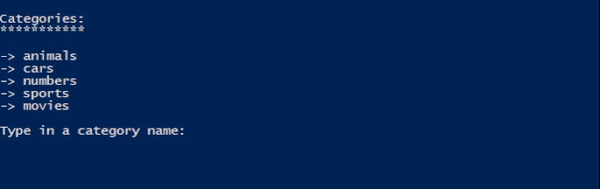

# Memory Game

## This Project was created within 2 days as my **_final project_** for the _JavaScript Basics_ modul from DCI.

> What was used:

- [x] readline-sync package to get user input
- [x] different callback functions for handling arrays and objects
- [x] useful functions to devide the code into specific parts for better readability
- [x] regular expression for checking user input

> Upcoming improvements:

- [ ] Better mixing algorithm for elements (at the moment there cant be matches within the same row)

## How to play ?

1. Download <a href="https://github.com/Steven-Mueller/Memory-Game/archive/refs/heads/main.zip" target="_blank">ZIP</a> and extract
2. Install [Node.js](https://nodejs.org/en/download/current)
3. Open Terminal or CMD/Powershell (depending on your OS) in extracted folder
4. Use `npm i` command in console to get needed dependencies
5. Type `node memory.js` to start the game
